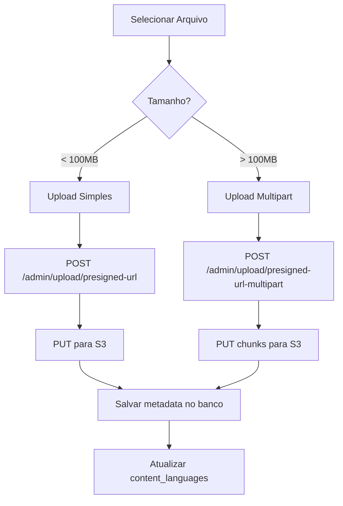
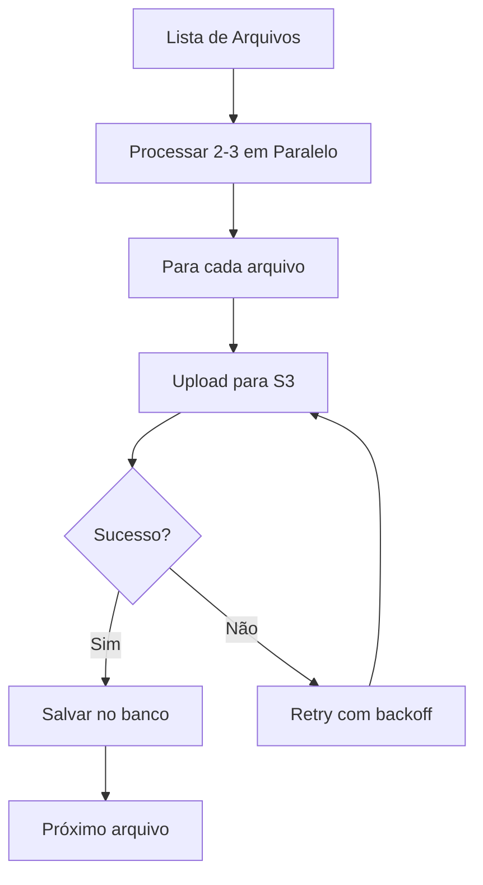

# Relatório de Análise: Sistema de Upload de Vídeos

Data: 10/10/2025
Status: EM ANDAMENTO

## 1. Situação Atual

### Upload Automático (Script)
- **Status**: Travado no primeiro arquivo (Superman - 1.74 GB)
- **Tempo decorrido**: ~10 minutos sem progresso visível
- **Problema**: Upload para S3 pode estar lento ou com problema de credenciais/rede
- **Fila**: 15 arquivos totalizando ~30+ GB

### Dashboard Admin - Upload Manual
- **Localização**: `/admin/content/video-upload/page.tsx`
- **Status**: ❌ NÃO FUNCIONAL PARA PRODUÇÃO
- **Problema**: Código usa simulações (linhas 108-167) ao invés de uploads reais para S3

## 2. Infraestrutura Disponível

### ✅ Backend - Endpoints Funcionais

#### Endpoint 1: Upload Simples (Arquivos < 100MB)
```
POST /api/v1/admin/upload/presigned-url
```
**Localização**: `backend/src/modules/admin/controllers/upload-presigned.controller.ts:34`

**Request**:
```json
{
  "filename": "movie.mp4",
  "contentType": "video/mp4",
  "contentId": "uuid-do-filme"  // opcional
}
```

**Response**:
```json
{
  "uploadUrl": "https://...", // URL pré-assinada para PUT
  "fileUrl": "https://...",    // URL pública final
  "key": "videos/...",         // Chave S3
  "expiresIn": 3600           // 1 hora
}
```

#### Endpoint 2: Upload Multipart (Arquivos > 100MB)
```
POST /api/v1/admin/upload/presigned-url-multipart
```
**Localização**: `backend/src/modules/admin/controllers/upload-presigned.controller.ts:93`

**Request**:
```json
{
  "filename": "movie.mp4",
  "contentType": "video/mp4",
  "fileSize": 1740000000,  // bytes
  "contentId": "uuid-do-filme"
}
```

**Response**:
```json
{
  "uploadUrl": "https://...",
  "fileUrl": "https://...",
  "key": "videos/...",
  "expiresIn": 3600,
  "multipart": {
    "chunkSize": 10485760,  // 10MB
    "numberOfParts": 166
  }
}
```

#### Endpoint 3: Upload por Idioma (Multipart + Metadata)
```
POST /api/v1/content-language-upload/initiate-multipart
POST /api/v1/content-language-upload/presigned-url
POST /api/v1/content-language-upload/complete-multipart
```
**Localização**: `backend/src/modules/content/controllers/content-language-upload.controller.ts`

## 3. Problemas Identificados

### ❌ Problema 1: Dashboard Admin Não Funcional
**Arquivo**: `admin/src/app/content/video-upload/page.tsx`

**Linhas problemáticas**:
- **Linhas 108-120**: Simula progresso de upload com `setInterval`
- **Linhas 122-136**: Simula conclusão após tempo aleatório
- **Linhas 139-166**: Simula transcodificação

**Impacto**: Nenhum vídeo é realmente enviado para S3!

### ❌ Problema 2: API Não Retorna Languages
**Arquivo**: API `/content/movies` não está populando o campo `languages`

**Evidência**:
```bash
curl http://localhost:3001/api/v1/content/movies
# Retorna: { "languages": [] } para todos os filmes
```

**Causa**: Endpoint não está fazendo JOIN com tabela `content_languages`

### ⏳ Problema 3: Upload Script Lento
**Arquivo**: `backend/scripts/upload-all-videos.js`

**Status**: Travado há 10+ minutos no primeiro arquivo (1.74 GB)

**Possíveis causas**:
1. Velocidade de upload da internet
2. AWS S3 timeout ou throttling
3. Falta de progress feedback
4. Erro silencioso não reportado

## 4. Recomendações de Melhoria

### 🔧 Prioridade ALTA: Implementar Upload Real no Admin

**Implementação recomendada**:

```typescript
// Fluxo para arquivos grandes (>100MB)
async function uploadLargeVideo(file: File, contentId: string) {
  // 1. Obter presigned URL multipart
  const initResponse = await fetch('/api/v1/admin/upload/presigned-url-multipart', {
    method: 'POST',
    headers: { 'Content-Type': 'application/json' },
    body: JSON.stringify({
      filename: file.name,
      contentType: file.type,
      fileSize: file.size,
      contentId
    })
  });

  const { uploadUrl, key, multipart } = await initResponse.json();
  const { chunkSize, numberOfParts } = multipart;

  // 2. Upload em chunks
  for (let partNumber = 1; partNumber <= numberOfParts; partNumber++) {
    const start = (partNumber - 1) * chunkSize;
    const end = Math.min(start + chunkSize, file.size);
    const chunk = file.slice(start, end);

    await fetch(uploadUrl, {
      method: 'PUT',
      body: chunk,
      headers: { 'Content-Type': file.type }
    });

    // Atualizar progresso
    const progress = (partNumber / numberOfParts) * 100;
    updateProgress(progress);
  }

  // 3. Salvar no banco via content_languages
  await saveVideoMetadata(contentId, key, file.size);
}
```

### 🔧 Prioridade MÉDIA: Otimizar Script de Upload

**Melhorias**:
1. ✅ Adicionar progress bar detalhado por arquivo
2. ✅ Implementar retry logic com exponential backoff
3. ✅ Upload paralelo de múltiplos arquivos (2-3 simultâneos)
4. ✅ Resumable uploads (salvar checkpoint)
5. ✅ Timeout aumentado para arquivos grandes

### 🔧 Prioridade MÉDIA: Corrigir API Movies

**Arquivo**: `backend/src/modules/content/content.service.ts` ou similar

**Adicionar**:
```typescript
// No método findAll() ou similar
const movies = await supabase
  .from('content')
  .select(`
    *,
    languages:content_languages(
      id, audio_type, language, video_url,
      quality, status, is_primary
    )
  `)
  .eq('content_type', 'movie');
```

## 5. Fluxo Recomendado para Produção

### Para Upload Manual (Admin Dashboard):



### Para Upload em Massa (Script):



## 6. Testes Necessários

### ✅ Testes a Realizar:

1. **Upload Pequeno (< 100MB)**
   - Testar endpoint `/admin/upload/presigned-url`
   - Verificar se arquivo aparece no S3
   - Confirmar URL pública acessível

2. **Upload Grande (> 100MB)**
   - Testar multipart upload
   - Verificar progress tracking
   - Confirmar reassembly no S3

3. **Fluxo Completo Admin**
   - Criar conteúdo
   - Upload de vídeo
   - Upload de poster/thumbnail
   - Verificar no frontend

4. **Performance**
   - Medir tempo de upload por GB
   - Testar conexões lentas (throttling)
   - Verificar uso de memória no navegador

## 7. Próximos Passos

### Imediato (Hoje):
1. ✅ Implementar upload real no dashboard admin
2. ✅ Adicionar barra de progresso funcional
3. ✅ Testar com arquivo pequeno (< 100MB)
4. ⏳ Aguardar conclusão do upload automático (ou cancelar e otimizar)

### Curto Prazo (Esta Semana):
1. ⏳ Corrigir endpoint /movies para retornar languages
2. ⏳ Implementar upload multipart no admin
3. ⏳ Otimizar script de upload em massa
4. ⏳ Adicionar resumable uploads

### Médio Prazo:
1. ⏳ Implementar transcodificação automática (se necessário)
2. ⏳ Adicionar compressão/otimização de vídeo
3. ⏳ CDN para distribuição
4. ⏳ Analytics de visualização

## 8. Métricas Atuais

- **Total de filmes**: 10
- **Filmes com vídeo**: 0 (0%)
- **Upload em progresso**: 1 arquivo (Superman - 1.74 GB)
- **Tempo médio por GB**: Ainda não determinado
- **Taxa de sucesso**: 0/15 (0%)

## 9. Configuração Necessária

### Variáveis de Ambiente (.env):
```env
AWS_REGION=us-east-1
AWS_ACCESS_KEY_ID=your_key
AWS_SECRET_ACCESS_KEY=your_secret
AWS_S3_BUCKET=cinevision-filmes
NEXT_PUBLIC_API_URL=http://localhost:3001/api/v1
```

### Permissões S3 Necessárias:
- `s3:PutObject`
- `s3:GetObject`
- `s3:DeleteObject`
- `s3:ListBucket`

## 10. Conclusão

O sistema de upload possui toda a infraestrutura backend necessária, mas:

❌ **Dashboard admin não está conectado aos endpoints reais**
❌ **Script de upload automático está muito lento**
❌ **API não retorna dados de vídeo/idiomas**

**Ação Requerida**: Implementar o frontend do admin para usar os endpoints existentes de presigned URLs para uploads funcionais e rápidos.

**Tempo Estimado**: 2-3 horas para implementação completa do fluxo de upload no admin.
